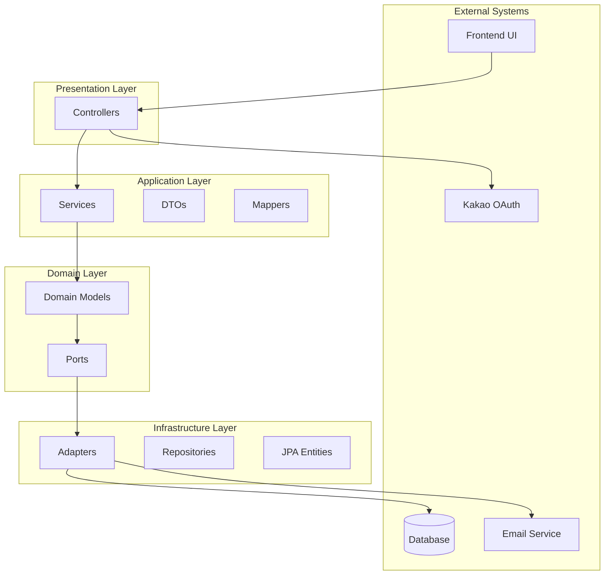

# 백엔드 아키텍처 분석

## 개요

이 문서는 Spring Boot 기반 팝업 스토어 대기열 관리 시스템의 아키텍처를 분석한 결과입니다. 시스템은 헥사고날 아키텍처(Hexagonal Architecture) 패턴을 기반으로 구축되었으며, 클린 아키텍처 원칙을 따릅니다.

## 1. 아키텍처 패턴

### 헥사고날 아키텍처 (Ports and Adapters)



### 핵심 아키텍처 원칙

- **의존성 역전**: 도메인 레이어가 외부 의존성으로부터 격리됨
- **단일 책임**: 각 레이어가 명확한 책임을 가짐
- **인터페이스 분리**: 도메인 포트가 외부 통합을 위한 계약을 정의
- **관심사 분리**: 레이어 간 명확한 경계

## 2. 레이어 구조

### 도메인 레이어 (`domain/`)

```
domain/
├── model/                    # 도메인 엔티티 및 값 객체
│   ├── Member.java          # 사용자 도메인 모델 (record)
│   ├── popup/               # 팝업 도메인
│   │   ├── Popup.java       # 핵심 팝업 엔티티
│   │   ├── PopupStatus.java # 값 객체들
│   │   ├── PopupType.java   
│   │   └── ...
│   ├── waiting/             # 대기열 도메인
│   │   ├── Waiting.java     # 핵심 대기열 엔티티
│   │   ├── WaitingStatus.java
│   │   └── ...
│   └── notification/        # 알림 도메인
└── port/                    # 출력 포트 (인터페이스)
    ├── MemberPort.java
    ├── WaitingPort.java
    ├── PopupPort.java
    └── NotificationPort.java
```

**책임**: 순수 비즈니스 로직, 도메인 규칙, 비즈니스 불변성 유지

### 애플리케이션 레이어 (`application/`)

```
application/
├── service/                 # 애플리케이션 서비스 (유스케이스 조율자)
│   ├── WaitingService.java  # 대기열 관리 유스케이스
│   ├── PopupService.java    # 팝업 관리 유스케이스
│   ├── NotificationService.java
│   └── ...
├── dto/                     # 데이터 전송 객체
│   ├── waiting/
│   ├── popup/
│   └── notification/
└── mapper/                  # DTO <-> 도메인 매핑
```

**책임**: 유스케이스 조율, 트랜잭션 경계, 도메인 서비스 조합

### 인프라스트럭처 레이어 (`infrastructure/`)

```
infrastructure/
├── persistence/             # 데이터베이스 어댑터
│   ├── adapter/            # 포트 구현체
│   ├── entity/             # JPA 엔티티
│   ├── repository/         # JPA 리포지토리
│   └── mapper/             # 엔티티 <-> 도메인 매핑
└── external/               # 외부 서비스 어댑터
    ├── NotificationSseAdapter.java  # SSE 구현
    └── GmailSmtpEmailAdapter.java   # 이메일 서비스
```

**책임**: 외부 시스템 통합, 데이터 영속화, 기술적 구현 세부사항

### 프레젠테이션 레이어 (`presentation/`)

```
presentation/
└── controller/             # REST 컨트롤러
    ├── WaitingController.java
    ├── PopupController.java
    ├── NotificationController.java
    └── handler/            # OAuth 핸들러
```

**책임**: HTTP 요청/응답 처리, 인증/인가, API 계약 정의

## 3. 핵심 도메인 모델

### Member (단순 레코드)
```java
public record Member(Long id, String name, String email) {}
```

### Popup (복합 도메인 모델)
```java
@Builder
public class Popup {
    private final Long id;
    private final String name;
    private final Location location;
    private final PopupSchedule schedule;
    private final PopupDisplay display;
    private final PopupType type;
    private final List<PopupCategory> popupCategories;
    private PopupStatus status;
    
    // 비즈니스 로직 메서드들
    public boolean isActive() { ... }
    public void activate() { ... }
}
```

### Waiting (풍부한 도메인 모델)
```java
public record Waiting(
    Long id, Popup popup, String waitingPersonName, 
    Member member, String contactEmail, Integer peopleCount,
    Integer waitingNumber, WaitingStatus status,
    LocalDateTime registeredAt, LocalDateTime enteredAt, LocalDateTime canEnterAt
) {
    // 비즈니스 로직 메서드
    public Waiting enter() { ... }
    public Waiting minusWaitingNumber() { ... }
    
    // 도메인 규칙 검증
    public void validatePeopleCount() { ... }
    public void validateWaitingPersonName() { ... }
}
```

### Notification (이벤트 기반)
```java
public class Notification {
    private final DomainEvent<?> event;
    private NotificationStatus status;
    
    public void read() { 
        this.status = this.status.read(); 
    }
    
    public boolean isUnread() { 
        return status == NotificationStatus.UNREAD; 
    }
}
```

## 4. 데이터 흐름과 컴포넌트 상호작용

### 일반적인 요청 흐름
```
HTTP 요청 → Controller → Service → Domain Model → Port Interface → Adapter → Database
                ↓
             JWT Filter → Security Context → UserPrincipal
```

### 알림 처리 흐름
```
Domain Operation → Notification Creation → Service Layer Processing → External Adapter
                                                                  ↓
                                                            실시간 알림 / 이메일
```

**구현 특징**: 서비스 레이어에서 직접 알림을 생성하고 처리하는 방식을 사용

### 트랜잭션 경계
- **서비스 레이어**: `@Transactional` 경계 설정
- **읽기 전용**: 조회 작업에 대한 최적화
- **이벤트 처리**: 비동기 이벤트 처리를 위한 별도 트랜잭션

## 5. 보안 아키텍처 (비-헥사고날 구조)

### 보안 계층의 구조적 특징

보안 처리 로직은 전형적인 헥사고날 아키텍처나 클린 아키텍처의 원칙과는 다른 방식으로 구현되어 있습니다.

#### 1. 보안 관심사의 계층 간 배치

**인프라스트럭처 계층 (기술적 보안)**:
```java
// Spring Security 설정 및 필터 체인
@Configuration @EnableWebSecurity
public class SecurityConfig {
    // JWT 필터, CORS, 세션 설정 등
}

// JWT 인증 필터 (전통적인 스프링 시큐리티 패턴)
public class JwtAuthenticationFilter extends OncePerRequestFilter {
    // 토큰 추출, 검증, SecurityContext 설정
}
```

**프레젠테이션 계층 (인증 주체 추출)**:
```java
@RestController
public class NotificationController {
    // @AuthenticationPrincipal로 사용자 정보 추출
    public ResponseEntity<> method(@AuthenticationPrincipal UserPrincipal user) {
        return service.method(user.getId()); // 서비스로 memberId 전달
    }
}
```

**애플리케이션 계층 (비즈니스 인가)**:
```java
@Service
public class NotificationService {
    public void markAsRead(Long memberId, Long notificationId) {
        // 비즈니스 로직으로 자원 소유권 검증
        if (!notification.getMemberId().equals(memberId)) {
            throw new BusinessException(ACCESS_DENIED_NOTIFICATION);
        }
    }
}
```

#### 2. 보안 처리의 구조적 문제

**계층 경계 넘나드는 보안 관심사**:
- 인증은 인프라스트럭처 계층에서 처리
- 인가는 애플리케이션 계층에 산재
- 사용자 식별 추출은 프레젠테이션 계층에서 수행

**헥사고날 원칙과의 차이점**:
- 도메인 포트를 통해 보안 관심사가 추상화되지 않음
- 비즈니스 로직과 보안 로직이 서비스 계층에서 혼재
- 보안 정책이 여러 계층에 분산되어 있음

#### 3. 실제 구현 패턴

**Spring Security 의존적 구조**:
```java
// 실제 인증 흐름
HTTP Request → Spring Security Filter Chain
           → JwtAuthenticationFilter  // 인프라스트럭처 계층
           → SecurityContext Setting
           → Controller              // 프레젠테이션 계층
           → @AuthenticationPrincipal
           → Service Layer           // 애플리케이션 계층
           → Business Authorization
```

**보안 컴포넌트의 역할**:
- **JwtTokenProvider**: JWT 생성/검증 로직 (인프라스트럭처 계층)
- **UserPrincipal**: Spring Security와 도메인 모델 간 브리지 역할
- **OAuth2Service**: 소셜 로그인 로직 (애플리케이션 계층)
- **Custom Exception Handlers**: 보안 예외를 통일된 에러 응답으로 변환

#### 4. 비-헥사고날 구조의 실용적 측면

**현재 구조의 특징**:
- Spring Security 프레임워크에 깊이 의존
- 보안 관심사를 별도 계층으로 추상화하지 않음
- 비즈니스 로직과 보안 로직이 서비스 계층에서 결합
- 인증과 인가의 처리 방식이 서로 다름

**도메인 계층의 순수성 유지**:
```java
// 도메인 모델은 보안 관심사에서 완전히 격리
 public record Waiting(Long id, Member member, ...) {
    // 보안 관련 로직 없음
 }
 ```

## 6. 알림 시스템 (하이브리드 이벤트-직접호출 구조)

### 하이브리드 알림 처리 방식

알림 시스템은 이벤트 드리븐 패턴과 전통적인 직접 호출 방식을 결합한 하이브리드 구조로 구현되어 있습니다.

#### 1. 두 가지 알림 트리거 패턴

**직접 메서드 호출 패턴 (즉시 알림)**:
```java
// WaitingService.createWaiting()에서 직접 호출
waitingNotificationService.processWaitingCreatedNotifications(savedWaiting);
```

**스케줄드 배치 패턴 (지연 알림)**:
```java
// 30초마다 실행되는 배치 스케줄러
@Scheduled(fixedDelay = 30_000)
public void processScheduledNotifications() {
    // 조건 기반 알림 처리
}
```

#### 2. 하이브리드 알림 플로우

```
비즈니스 작업 (대기 생성)
         ↓
    직접 서비스 호출
         ↓
WaitingNotificationService.processWaitingCreatedNotifications()
         ↓
    ┌─────────────────────┬──────────────────────────┐
    ↓                     ↓                          ↓
즉시 알림               미래 알림 스케줄링            추가 알림 스케줄링
(WAITING_CONFIRMED)      (ENTER_NOW)               (ENTER_3TEAMS_BEFORE)
    ↓                     ↓                          ↓
DB 저장 + SSE 전송      스케줄 DB 저장             스케줄 DB 저장
         ↓                     ↓                          ↓
    실시간 전달           배치 처리 (30초 간격)        배치 처리 (30초 간격)
                              ↓                          ↓
                        조건 검사                    조건 검사
                              ↓                          ↓
                        DB 저장 + SSE 전송          DB 저장 + SSE 전송
```

#### 3. 도메인 이벤트의 데이터 컨테이너 역할

**Spring 이벤트가 아닌 값 객체로서의 도메인 이벤트**:
```java
// 도메인 이벤트는 Spring 이벤트가 아닌 불변 값 객체
public class WaitingDomainEvent extends DomainEvent<Waiting> {
    private final WaitingEventType eventType;
    // 이벤트 발행이 아닌 컨텍스트 저장용
}

// Notification에 이벤트 정보 포함
public class Notification {
    private final DomainEvent<?> event;  // 데이터로서 저장되는 이벤트
}
```

**직접 서비스 조율 방식**:
```java
// @EventListener 없음 - 직접 메서드 호출
public void processWaitingCreatedNotifications(Waiting waiting) {
    sendWaitingConfirmedNotification(waiting);  // 직접 호출
    List<ScheduledNotification> schedules = createScheduledNotifications(waiting);
    schedules.forEach(scheduledNotificationPort::save);  // 직접 영속화
}
```

#### 4. 도메인 이벤트와 실제 처리의 분리

**도메인 이벤트의 역할**:
- 알림을 유발한 비즈니스 컨텍스트 저장
- 알림 콘텐츠 생성을 위한 타입 정보 제공
- 비즈니스 이벤트의 이력 기록

**실제 처리 메커니즘**:
- Spring의 이벤트 발행 메커니즘 미사용 (`@EventListener`, `ApplicationEventPublisher` 없음)
- 서비스 계층에서 직접적인 메서드 호출로 조율
- 트랜잭션 일관성을 위한 동기적 처리

#### 5. 다중 전송 채널 처리

**실시간 SSE 알림**:
```java
// SSE 연결이 있을 때만 즉시 전송
if (notificationEventPort.isConnected(memberId)) {
    notificationEventPort.sendRealTimeNotification(memberId, savedNotification);
} else {
    log.debug("SSE connection not found, skipping real-time notification");
}
```

**이메일 알림 (선택적)**:
```java
// 특정 비즈니스 로직에서만 이메일 발송
if (eventType.equals(WaitingEventType.ENTER_NOW.name())) {
    Waiting waiting = extractWaitingFromNotification(scheduledNotification);
    sendEntryEmailNotification(waiting);  // 비동기 이메일 전달
}
```

**영구 알림 저장**:
```java
// 모든 알림은 전송 방식과 관계없이 영속화
Notification savedNotification = notificationPort.save(notification);
```

#### 6. 하이브리드 구조의 특징

**직접 호출을 사용하는 영역**:
- 서비스 간 조율 (WaitingService → WaitingNotificationService)
- 즉시 알림 처리 (동기적 플로우)
- 스케줄된 알림 트리거링 (배치 폴링 패턴)

**이벤트를 데이터로 사용하는 영역**:
- 비즈니스 컨텍스트 저장 (WaitingDomainEvent)
- 알림 콘텐츠 생성을 위한 타입 기반 분기
- 영속 저장소에서 이벤트 재구성

**복잡한 트리거 조건 처리**:
```java
// 스케줄된 알림의 정교한 비즈니스 규칙
private boolean isTriggerConditionSatisfied(ScheduledNotification notification) {
    return switch (trigger) {
        case WAITING_ENTER_NOW -> waiting.waitingNumber() == 0 && waiting.status() == WAITING;
        case WAITING_ENTER_3TEAMS_BEFORE -> calculateCurrentWaitingPosition(waiting) == 3;
        // 추가 조건들...
    };
}
```

### 하이브리드 접근법의 구현 특징

- **즉시 일관성**: 직접 호출로 비즈니스 작업과 동일 트랜잭션에서 알림 생성 보장
- **신뢰성**: 메시지 버스 실패 위험 없는 확실한 전달
- **단순성**: 복잡한 이벤트 라우팅이나 리스너 등록 불필요
- **성능**: 시간 기반 알림을 위한 배치 처리로 데이터베이스 부하 감소
- **감사 가능성**: 도메인 이벤트로 각 알림의 원인에 대한 명확한 이력 제공

## 7. 예외 처리 시스템

### 포괄적 에러 관리
```java
@Getter @RequiredArgsConstructor
public enum ErrorType {
    // 도메인별 에러
    POPUP_NOT_FOUND(HttpStatus.NOT_FOUND, "POPUP_NOT_FOUND", "팝업을 찾을 수 없습니다"),
    INVALID_WAITING_STATUS(HttpStatus.BAD_REQUEST, "INVALID_WAITING_STATUS", "유효하지 않은 대기 상태입니다"),
    
    // 인증 에러
    AUTHENTICATION_REQUIRED(HttpStatus.UNAUTHORIZED, "AUTHENTICATION_REQUIRED", "인증이 필요합니다"),
    INVALID_TOKEN(HttpStatus.UNAUTHORIZED, "INVALID_TOKEN", "유효하지 않은 토큰입니다"),
    
    // ... 60개 이상의 포괄적 에러 유형
}
```

### 통일된 에러 응답
```json
{
  "code": "ERROR_CODE",
  "message": "사용자 친화적 메시지",
  "additionalInfo": "추가 정보",
  "errors": [/* 파라미터 검증 오류 */],
  "timestamp": "2025-01-01T12:00:00",
  "path": "/api/endpoint"
}
```

## 8. 데이터베이스 설계

### 데이터베이스 전략
- **개발환경**: H2 인메모리 데이터베이스
- **프로덕션**: Supabase를 통한 PostgreSQL
- **연결 풀**: 최적화된 설정의 HikariCP

### 엔티티 매핑 패턴
```java
// 인프라스트럭처 엔티티
@Entity @Table(name = "popups")
public class PopupEntity {
    @Id @GeneratedValue(strategy = GenerationType.IDENTITY)
    private Long id;
    private String title;
    // ... 기타 필드
}

// 도메인-인프라스트럭처 매핑
@Component
public class PopupEntityMapper {
    public Popup toDomain(PopupEntity entity) { ... }
    public PopupEntity toEntity(Popup domain) { ... }
}
```

## 9. 설정 및 배포

### 환경 프로파일
- **local**: H2 데이터베이스, 개발 설정
- **dev**: Swagger UI를 포함한 개발 환경
- **prod**: PostgreSQL, 메트릭, 보안 강화가 적용된 프로덕션

### 외부 설정
```yaml
# 환경 변수
OAUTH2_KAKAO_CLIENT_ID: OAuth 클라이언트 ID
JWT_ACCESS_TOKEN_SECRET: JWT 서명 비밀키
SUPABASE_HOST: 프로덕션 데이터베이스 호스트
FRONTEND_URL: CORS 설정
```

### 빌드 구성
- **Java 21**: 최신 Java 기능 활용
- **Spring Boot 3.4.6**: 최신 안정 버전
- **Gradle**: 병렬 테스트 실행을 포함한 빌드 자동화
- **Docker**: 컨테이너화된 배포

## 10. 주요 기술적 결정

### 아키텍처 패턴
✅ **헥사고날 아키텍처**: 비즈니스 로직과 인프라스트럭처의 명확한 분리  
✅ **도메인 주도 설계**: 비즈니스 로직을 포함한 풍부한 도메인 모델  
✅ **CQRS-lite**: 알림을 위한 읽기/쓰기 모델 분리  
✅ **이벤트 기반 아키텍처**: 비동기 알림 처리  

### 기술 선택
✅ **Spring Boot 3.x**: Java 21을 활용한 최신 Spring 스택  
✅ **JWT 인증**: 상태를 가지지 않는 확장 가능한 인증  
✅ **PostgreSQL**: 프로덕션급 관계형 데이터베이스  

### 디자인 패턴
✅ **리포지토리 패턴**: 깔끔한 데이터 액세스 추상화  
✅ **어댑터 패턴**: 인프라스트럭처 어댑터가 도메인 포트 구현  
✅ **빌더 패턴**: 복잡한 객체 생성  
✅ **전략 패턴**: 다양한 알림 전송 전략  

## 결론

이 아키텍처는 헥사고날 아키텍처 원칙을 따르면서도 실용적 구현을 위해 몇 가지 독특한 접근을 취한 Spring Boot 애플리케이션입니다:

### 장점
- **명확한 레이어 분리**: 도메인 로직과 인프라스트럭처의 깔끔한 분리
- **포괄적 에러 처리**: 60개 이상의 구체적이고 사용자 친화적인 에러 타입
- **커스터마이징된 보안**: 기존 패턴을 개선한 세밀한 인증/인가 처리
- **실용적 설계**: 이론적 순수성보다 구현 편의성을 고려한 균형잡힌 접근

전체적으로 헥사고날 아키텍처 원칙을 기반으로 구축된 안정적인 시스템이며, 팝업 스토어 대기열 관리 도메인의 요구사항을 반영하고 있습니다.