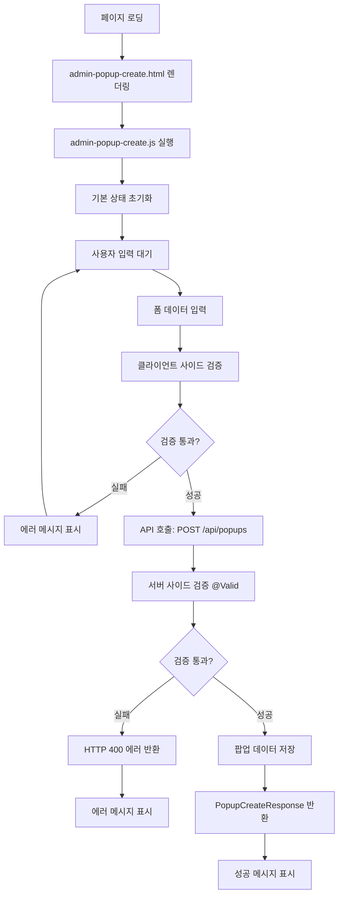

# 백엔드 관리자 페이지 기능 분석 보고서

## 1. 개요

본 문서는 JECT-3th-6team 백엔드 프로젝트의 관리자 페이지 기능을 체계적으로 분석한 결과를 정리한 보고서입니다. 관리자 페이지는 팝업 스토어 생성을 위한 웹 기반 관리 도구로 구현되어 있습니다.

### 주요 파일
- **HTML**: `src/main/resources/static/admin-popup-create.html`
- **JavaScript**: `src/main/resources/static/admin-popup-create.js`
- **보안 설정**: `src/main/java/com/example/demo/config/SecurityConfig.java`

## 2. 보안 설정 분석

### 2.1 Spring Security 구성

**SecurityConfig.java**에서 관리자 페이지에 대한 보안 설정은 다음과 같습니다:

#### 프로파일별 보안 정책
- **`sse-test` 프로파일**: 개발/테스트 환경용으로 관대한 접근 권한
- **일반 프로파일**: 프로덕션 환경용 기본 설정

#### 관리자 페이지 접근 권한
```java
.requestMatchers(
    "/admin-popup-create.html",
    "/admin-popup-create.js"
).permitAll()
```

#### API 접근 권한
```java
// 팝업 생성 API - 현재 무인증 허용
.requestMatchers(HttpMethod.POST, "/api/popups").permitAll()
// 주석: "임시: 팝업 생성 무인증 허용"
```

### 2.2 보안상 주요 이슈

⚠️ **현재 관리자 페이지와 팝업 생성 API 모두 무인증으로 접근 가능**
- 보안상 심각한 위험 요소
- 누구나 팝업 스토어 생성 가능
- 프로덕션 환경에서는 즉시 개선 필요

## 3. 정적 리소스 처리

### 3.1 WebConfig 설정
```java
@Profile("sse-test")
public class WebConfig implements WebMvcConfigurer {
    @Override
    public void addResourceHandlers(ResourceHandlerRegistry registry) {
        registry.addResourceHandler("/static/**")
                .addResourceLocations("classpath:/static/");
        
        registry.addResourceHandler("/**")
                .addResourceLocations("classpath:/static/");
    }
}
```

### 3.2 리소스 서빙 방식
- **디렉토리**: `src/main/resources/static/`
- **접근 경로**: 루트 경로(`/**`)에서 직접 접근
- **활성화 조건**: `sse-test` 프로파일에서만 동작

## 4. JavaScript 기능 분석

### 4.1 상태 관리
```javascript
const state = {
  openingHours: [],
  imageUrls: [""],
  sns: [{ iconUrl: "", linkUrl: "" }],
};
```

### 4.2 주요 기능

#### 동적 UI 관리
1. **운영시간 관리**
   - 요일별 운영시간 추가/삭제
   - 시작시간/종료시간 설정
   - 실시간 UI 업데이트

2. **이미지 URL 관리**
   - 여러 이미지 URL 동적 추가/삭제
   - 최소 1개 이미지 필수

3. **SNS 링크 관리**
   - 아이콘 URL과 링크 URL 쌍으로 관리
   - 동적 추가/삭제 기능

#### 폼 검증
```javascript
if (!payload.name || !payload.startDate || !payload.endDate) {
  result.textContent = '필수값(이름/기간)을 입력하세요';
  return;
}
```

### 4.3 API 통신
```javascript
const res = await fetch('/api/popups', {
  method: 'POST',
  headers: { 'Content-Type': 'application/json' },
  body: JSON.stringify(payload),
  credentials: 'include',
});
```

## 5. API 연동 분석

### 5.1 팝업 생성 API 구조

#### 엔드포인트
- **URL**: `POST /api/popups`
- **컨트롤러**: `PopupController.createPopup()`
- **서비스**: `PopupService.create()`

#### 데이터 플로우
1. **Frontend → Backend**: JSON 형태로 팝업 정보 전송
2. **PopupCreateRequest**: DTO를 통한 데이터 수신 및 검증
3. **PopupService**: `PopupDtoMapper`를 통해 도메인 객체 변환
4. **PopupPort**: 헥사고날 아키텍처의 아웃바운드 포트를 통한 데이터 저장
5. **PopupCreateResponse**: 생성 결과 반환

### 5.2 요청 데이터 구조
```java
public record PopupCreateRequest(
    @NotBlank String name,
    @NotBlank String type,
    @NotNull LocalDate startDate,
    @NotNull LocalDate endDate,
    @NotNull @Valid LocationCreate location,
    @NotNull @Size(min = 1) List<OpeningHoursCreate> weeklyOpeningHours,
    @NotNull @Size(min = 1) List<String> imageUrls,
    @NotNull @Valid ContentCreate content,
    @NotNull List<SnsCreate> sns,
    @NotNull @Size(min = 1) List<Long> categoryIds
)
```

## 6. 전체 동작 플로우



### 단계별 상세 설명

1. **초기화 단계**
   - HTML 페이지 로딩
   - JavaScript 상태 초기화
   - 기본 UI 요소 생성 (빈 이미지 URL, 기본 SNS 항목)

2. **데이터 입력 단계**
   - 기본 정보: 이름, 타입, 운영 기간
   - 위치 정보: 주소, 시/도/구, 좌표
   - 운영시간: 요일별 시간 설정
   - 컨텐츠: 소개, 공지사항
   - 카테고리: 체크박스 선택

3. **검증 단계**
   - 클라이언트: 필수 필드 및 기본 형식 검증
   - 서버: `@Valid` 어노테이션을 통한 완전한 검증

4. **저장 단계**
   - 헥사고날 아키텍처를 통한 계층적 처리
   - 도메인 객체 변환 및 비즈니스 로직 적용
   - 데이터베이스 저장

## 7. 아키텍처 특징

### 7.1 헥사고날 아키텍처 적용
- **Presentation Layer**: PopupController
- **Application Layer**: PopupService, PopupDtoMapper
- **Domain Layer**: Popup 도메인 모델
- **Infrastructure Layer**: PopupPort 구현체

### 7.2 기술 스택
- **Frontend**: 순수 HTML/CSS/JavaScript (프레임워크 없음)
- **Backend**: Spring Boot + Spring Security
- **검증**: Bean Validation (`@Valid`, `@NotBlank`, `@NotNull`)
- **데이터 전송**: JSON 기반 REST API

## 8. 개선 권장사항

### 8.1 보안 개선 (최우선)
1. **관리자 인증 시스템 도입**
   ```java
   .requestMatchers("/admin/**").hasRole("ADMIN")
   ```

2. **JWT 토큰 기반 인증**
   - 관리자 전용 토큰 발급
   - 토큰 검증 미들웨어 적용

3. **CSRF 보호 강화**
   - 관리자 페이지용 CSRF 토큰

### 8.2 기능 개선
1. **파일 업로드 시스템**
   - 이미지 URL 직접 입력 → 파일 업로드
   - 이미지 리사이징 및 최적화

2. **카테고리 관리 개선**
   ```javascript
   // 하드코딩된 카테고리 대신
   const categories = await fetch('/api/categories').then(r => r.json());
   ```

3. **주소 검색 API 연동**
   - Kakao Map API 또는 Daum 우편번호 서비스
   - 좌표 자동 입력 기능

4. **실시간 미리보기**
   - 입력 내용의 실시간 미리보기
   - 팝업 상세 페이지와 동일한 레이아웃

### 8.3 UX 개선
1. **필드별 에러 표시**
   ```javascript
   // 현재: 전체 에러 메시지
   // 개선: 필드별 개별 에러 표시
   ```

2. **진행 상태 표시**
   - 폼 작성 진행률 표시
   - 필수/선택 필드 구분

3. **자동 저장 기능**
   - LocalStorage를 활용한 임시 저장
   - 페이지 새로고침 시 데이터 복구

### 8.4 코드 품질 개선
1. **TypeScript 도입**
   - 타입 안전성 향상
   - IDE 지원 강화

2. **모듈화**
   - 기능별 JavaScript 모듈 분리
   - 재사용 가능한 컴포넌트 작성

3. **테스트 코드 추가**
   - 단위 테스트 (Jest)
   - E2E 테스트 (Cypress/Playwright)

## 9. 결론

현재의 관리자 페이지는 팝업 스토어 생성에 필요한 모든 기능을 포함하고 있으며, 사용자 친화적인 인터페이스를 제공합니다. 헥사고날 아키텍처를 잘 활용하여 유지보수성이 높은 구조를 갖추고 있습니다.

**하지만 가장 중요한 보안 이슈가 있습니다:**
- 무인증 접근 허용으로 인한 보안 위험
- 프로덕션 배포 전 반드시 인증 시스템 구현 필요

기능적으로는 완성도가 높으나, 보안 강화와 UX 개선을 통해 더욱 안전하고 사용하기 쉬운 관리자 도구로 발전시킬 수 있습니다.